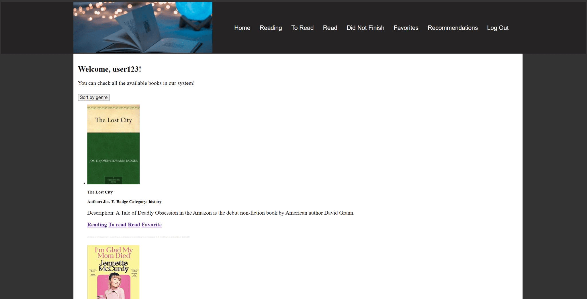

<h3>Project Code (5%)</h3>

<h3>1. Instructions to run the project</h3>
<h3>Getting started</h3>
Import sql file into a local database tool, check if the database name is matched with dbh.php in backend folder  
Unzip the download file and move it to the path :\xampp\htdocs if you are using xampp as PHP development environment  
Go to http://localhost/comp354Project in your web browser to access the frontend

<h3>Log in with the test user</h3>
Username: user123  
Password: 123456  
or feel free to create you own account to try out

<h3>Database setup</h3>
dump-bookappdb-202211281538 is the sql file to set up the database  
create a local database called bookappdb, then import the sql file into the database  

<h3>2. Dependencies used in the project</h3>
<h3>3. Screenshots of the project</h3>

<h3>4. Coding standards in the project</h3>
<h3>5. Folder structure explained</h3>
<h3>6. Summary</h3>
This is a Book-Project web app with shelves: 
&nbsp;&nbsp;&nbsp;Reading: Books that are currently being read 
&nbsp;&nbsp;&nbsp;Read: Books that are already read 
&nbsp;&nbsp;&nbsp;To Read: Books that will be read in the future 
&nbsp;&nbsp;&nbsp;Favorites: which contains all the books most liked by the user 
&nbsp;&nbsp;&nbsp;Recommendations: containing books recommended for the user
based on the user’s interest 

Created a local database called bookappdb with three tables (book, records, user) 
login, signup system are included 
Home page can show all books that exist in the database 
The recommendation of books to a user is based on book genres in this user's reading shelf 
